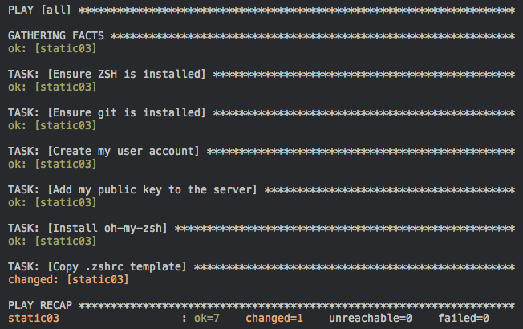

# Ensuring a Command Module Task is Repeatable with Ansible



A few readers have pointed out to me that there is a small improvement I could make to the simple [Ansible](http://www.ansible.com/home) playbook I created for my [Ansible Quick Start post](https://ryaneschinger.com/blog/ansible-quick-start/). Idempotence is an important concept in Ansible and the last task in the playbook was violating that principle.

Here is the original task:

```yaml
---
- name: Copy .zshrc template
  command: cp ~/.oh-my-zsh/templates/zshrc.zsh-template ~/.zshrc
  remote_user: ryan
  sudo: false
```

## Can you see the problem?

There are actually 2 related problems. First, the command in this task is always going to executed when running the playbook and, when looking at the Ansible output, it will always report changed.

```
TASK: [Copy .zshrc template] **************************************************
changed: [104.131.3.142]
```

And, that should make clear the bigger problem. Not only is this task still executing the command when the server is already in the correct state but it is also potentially destructive. If you had made changes to the zshrc file in between playbook runs, your changes would be lost.

Thankfully, there is an easy way to fix this in Ansible. The [command module](http://docs.ansible.com/command_module.html) has a creates parameter that lets you specify a filename that is used to control whether or not the command needs to be run. If the filename you specify in the creates parameter exists, the command will not be run. Here is the new task:

```yaml
---
- name: Copy .zshrc template
  command: creates="~/.zshrc" cp ~/.oh-my-zsh/templates/zshrc.zsh-template ~/.zshrc
  remote_user: ryan
  sudo: false
```

Now, when you run the playbook a second (or nth) time, it will properly skip this task.

```
TASK: [Copy .zshrc template] **************************************************
skipping: [104.131.3.142]
``` 

Many Ansible modules have idempotence baked in. But, when you are using some of the lower level modules like [command](http://docs.ansible.com/command_module.html) or [shell](http://docs.ansible.com/shell_module.html), you do have to be careful that you write your tasks in such a way that they are idempotent and safe to repeat. Thankfully, Ansible gives us some tools to make this easier.

source : https://ryaneschinger.com/