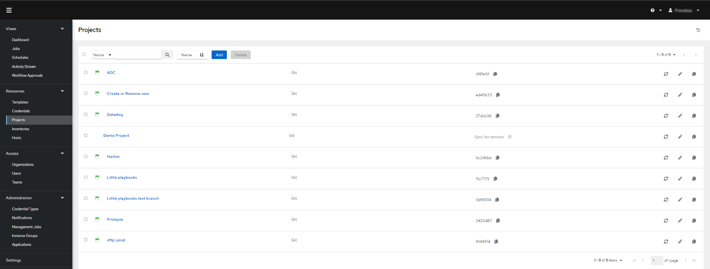
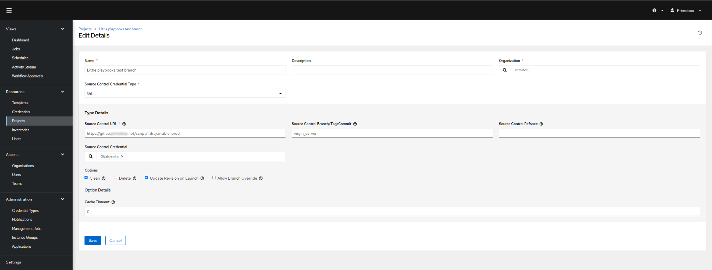
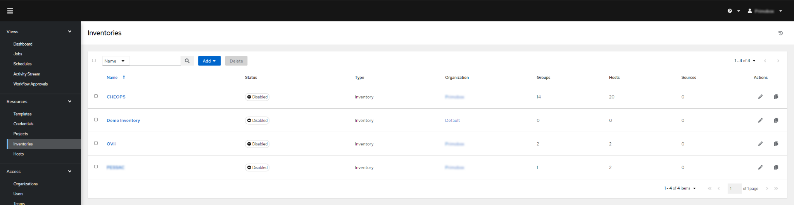
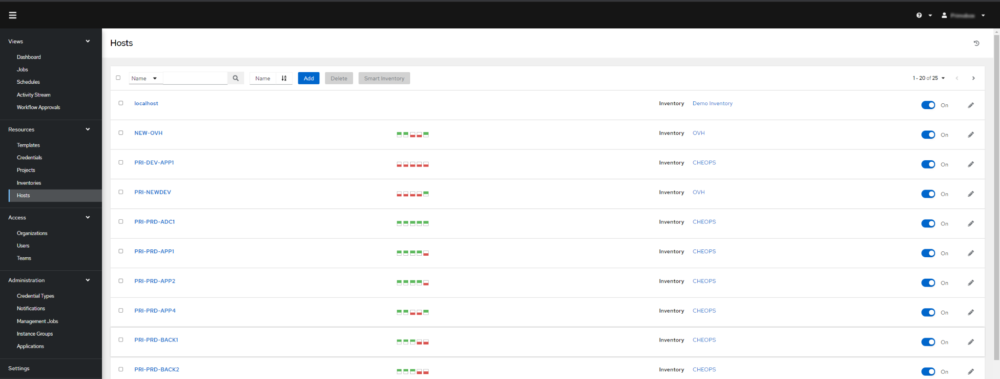
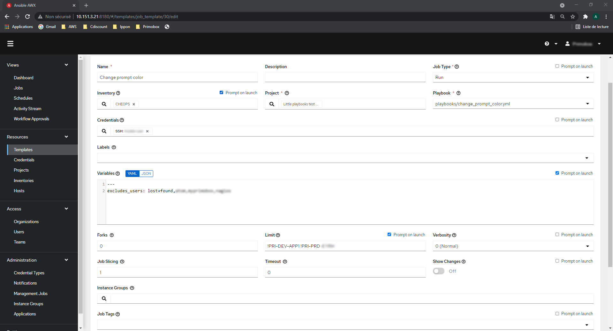
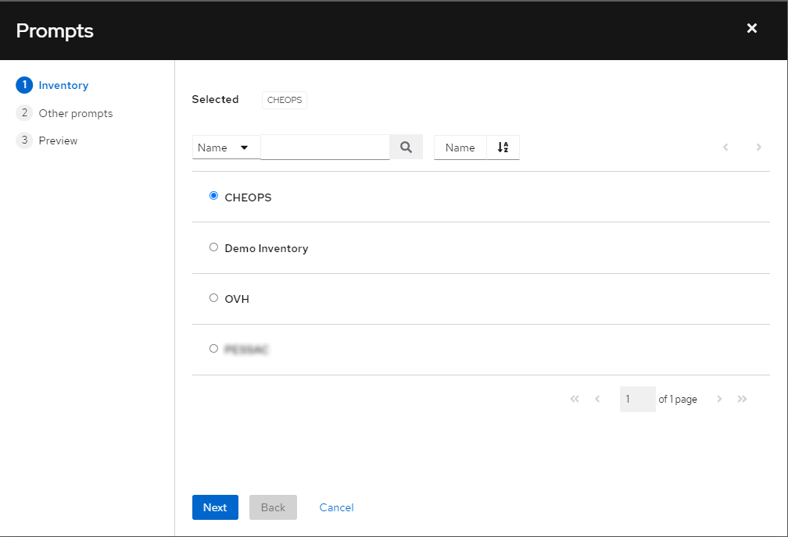
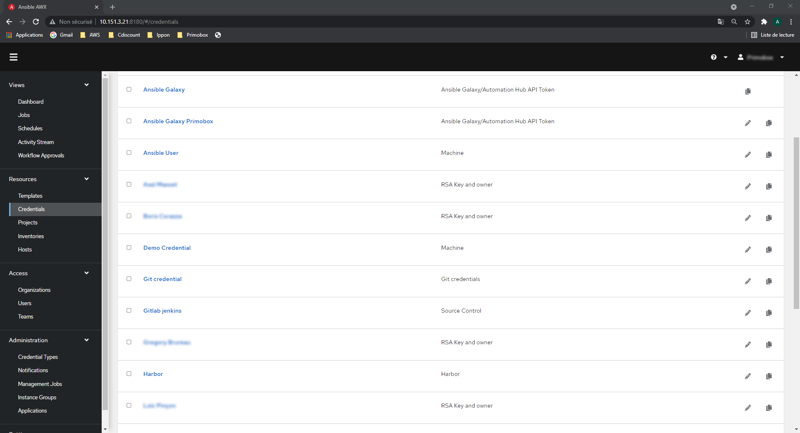
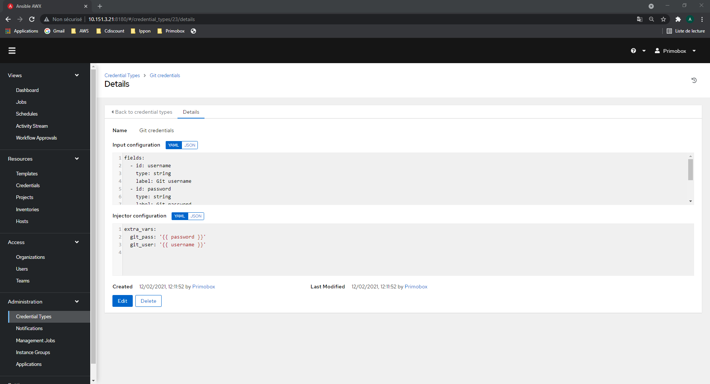

# Gérer et exécuter en toute simplicité ses projets grâce à AWX

## Qu’est-ce qu’AWX ?
AWX est un produit conçu par RedHat. Il se présente comme un véritable orchestrateur pour vos projets et playbooks Ansible. Le produit offre une centralisation de vos projets Git, hosts, credentials, et variables, le tout avec une gestion fine des accès et droits utilisateurs.

RedHat nous propose un soft accessible via une IHM, mettant à disposition un suivi complet de nos jobs Ansible en temps réel et d’un simple coup d'œil.

Bien qu’AWX se présente comme une couche additionnelle à Ansible, elle est totalement transparente et ne complexifie en aucun cas l’utilisation d’Ansible et de nos playbooks, bien au contraire. C’est ce qui fait la grande force du produit.

## AWX et Ansible Tower, quelle différence ?
Ansible Tower est considéré comme la version entreprise d’AWX. Toutes les releases d’Ansible tower sont issues de AWX qui est un projet open source soutenue par RedHat.

Sur le plan technique, on y retrouve la même chose. Néanmoins, RedHat ne garantit pas la stabilité d’AWX. Sa sécurité est elle aussi moindre, le code n’étant pas soumis à des tests complets et les images ne sont pas signées.
Bien évidemment, aucun support n’est fourni par RedHat, mais le plus gros inconvénient d’ AWX est qu’il ne dispose que d’une prise en charge minimale pour les montées de version, sachant que celles effectuées entre plusieurs releases ne sont pas testées. Il est donc fortement recommandé d'effectuer les montées de versions une par une.

## Projet
De manière générale, un projet Ansible contient l’ensemble des playbooks nécessaires à notre projet, mais également un inventaire qui englobe les machines ciblées par nos playbook, ou encore des modules créés par la communauté Ansible nommé “Collections” ou “Roles”

L’ensemble des projets créés pour la construction de vos playbook peuvent être recensées et centralisés à travers AWX, puis stockés directement sur la machine host d’AWX.

Plusieurs possibilités sont offertes quant à la localisation des projets.
Il est possible de localiser les projets directement sur la machine host d’AWX (par défaut dans /var/lib/awx/projects), mais il est également possible de passer par le système de Red Hat “Insights” ou encore directement par un repository comme Git ou GitLab.

A noter que l’utilisation d’un repository propose par défaut de synchroniser la branche master, mais il est tout à fait possible de la synchroniser sur une autre branche, via un tag ou un commit précis.
Cela offre de nombreuses perspectives d’un point de vue cloisonnement pour la gestion des accès et des droits, ainsi que sur le cloisonnement des projets liés à la production, aux tests ou au développement.

## Inventaire et Host
Lors d’une utilisation classique d’Ansible, les machines cibles (les hosts) de nos différents playbooks sont déclarées dans des inventaires, par défaut dans le fichier host, et ne sont utilisables que pour les playbooks issue du même projet Ansible.

AWX offre une nouvelle approche avec la centralisation, sur la plateforme, de tous nos inventaires et donc de nos hosts. De ce fait, nos projets sont directement impactés car il n’est plus nécessaire de s'attarder sur cette partie durant la phase développement des playbooks Ansible.

Le regroupement des inventaires est l’un des gros atouts d’AWX. Ici, l'ensemble des playbooks peuvent communiquer avec les hosts. Plus besoin de les configurer pour chaque projet, de même pour les variables. Ces dernières peuvent être déployées sur plusieurs couches, directement sur les inventaires (ce qui impacte tous les hosts associés), à l’unité pour chaque host ou bien dans un groupe rattaché à plusieurs hosts d’un même inventaire.

## Template
Les templates AWX sont simplement des launchers pour vos playbooks. Si vos inventaires, host, et projets sont déjà configurés, il ne reste normalement plus grand-chose à faire. Les Templates offrent néanmoins quelques options intéressantes qui ne sont plus à déclarer lors du développement de notre playbook Ansible, comme par exemple l'élévation de privilèges.

L’option la plus intéressante d’un template est la possibilité d’ouvrir un prompt au lancement du playbook afin de demander à l’utilisateur d’intervenir, nous pouvons ainsi lui demander de choisir l’inventaire sélectionné pour notre job ou encore sur quelles machines exécuter le playbook. Très pratique quand associé à une gestion fine des droits utilisateurs.

## Credentials
La section “Credentials” vous permet de regrouper l’ensemble des comptes et clefs utilisés pour vos playbooks ou par Ansible. À noter que les informations sensibles, comme vos mots de passe, sont chiffrées.

Par défaut, AWX propose diverses options de credentials. Tous sont associés à une utilisation spécifique, comme les comptes de connexion ssh utilisés par ansible ou encore vos credentials Git utilisés pour la synchronisation de vos projets et playbooks.

Dans le cas d’un besoin spécifique pour vos playbooks, AWX propose de créer soit même ses credentials. Le processus se découpe en deux parties, la section “Input configuration” pour concevoir les champs affichés (ce qui modifie directement le CSS sur l’IHM) et “Injector configuration” pour associer des variables à ces champs. Ces variables pourront ensuite être appelées directement dans vos playbooks.

À noter qu’il est également possible d'associer Ansible Vault, ce qui est très utile quand vous disposez d’un nombre conséquent de credentials.

## Inconvénients et Avantages : Résumé
### Inconvénients

**AWX :**
- Montée de version pas toujours simple
- Stabilité inégale en fonction des versions
- Sécurité logicielle plus faible que Ansible Tower

**Ansible Tower :**
- Payant pour Ansible Tower

### Avantages :
- Surcouche Ansible totalement transparente
- Centralisation des toutes les configurations, inventaire, playbooks et credentials
- Gestion fine des permissions
- Possibilité d’exécuter des playbooks d’un simple clic, pratique pour être utilisé par des néophytes en Ansible.

source : https://blog.ippon.fr/