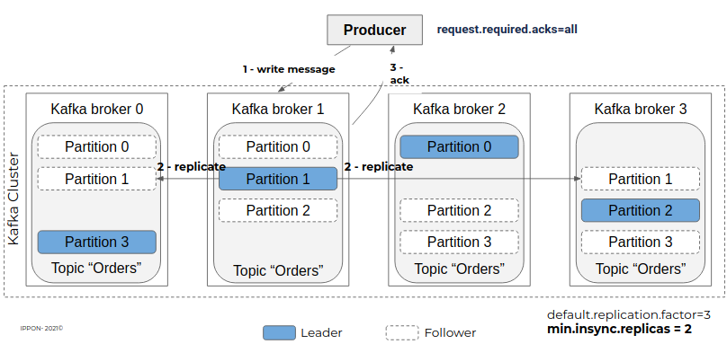

# Event-driven architecture - Comment se lancer avec Kafka ? (partie 1)

Une architecture orientée événements (en anglais : event-driven architecture) est un paradigme de plus en plus utilisé dans les architectures modernes à base de microservices, qui promet une application plus réactive aux événements métier tout en offrant un meilleur découplage technique.

Séduisant ! Mais comment bien démarrer ?

Dans cet article en 2 parties, je vous propose de passer en revue les éléments importants à considérer pour démarrer la mise en place d’une architecture orientée événements avec Kafka.

## Architecture event-driven et Kafka
Dans cette première partie, je tenterai de définir ce qu’est une architecture event-driven et comment Kafka peut être utilisé pour construire ce type d’architecture.

### Architecture event-driven
Pour définir ce qu’est une architecture event-driven, revenons d’abord sur les concepts de commande et d’événement.

#### Commande vs Evénement
Une commande est initiée par un utilisateur ou un composant technique, qui demande à un système de réaliser une action.

Un **événement** est initié par le système pour exprimer le fait que quelque chose s’est produit.

La différence fondamentale entre les deux est la suivante :

- Lorsque la commande est lancée, l’action **n’est pas encore réalisée et l’état du système n’est pas encore affecté**. Elle peut aboutir ou non et on peut la retenter en la modifiant si nécessaire.
- Lorsque l’événement est instancié, **l’action est déjà réalisée et l’état du système est déjà affecté**. L’événement est donc immuable et devra être traité.

### Orchestration vs Chorégraphie
Dans un scénario construit à base de commandes, le service sollicité par la commande initiale pilote l’action des autres services impliqués.

Ici, lorsque le service de paiement va traiter la demande de validation, il va solliciter les autres services pour déclencher les actions qui suivent l’action de validation : par exemple ici l’instanciation de la commande correspondant au paiement et l’ajout de points de fidélité. C’est donc le service de paiement qui orchestre ici le scénario.

Reprenons le même scénario avec une approche event-driven : une fois que le service de paiement a traité la demande de validation dont il est responsable, il va émettre un événement sur un bus d’événements. Cet événement sera ici consommé par les services de commande et de fidélisation pour déclencher les actions qui suivent la validation d’un paiement.

Ces services agissent de manière indépendante à partir d’un événement ce qui s’apparente ici à une chorégraphie.

### Bénéfices
Le premier bénéfice qui apparaît dans l’exemple précédent est le **découplage des composants**. Le service de paiement réalise le traitement dont il est responsable et avertit qu’il a terminé, sans se soucier des actions qui doivent suivre la validation du paiement. Il peut également répondre à la demande de l’utilisateur même si les services commandes et fidélisation sont indisponibles, ce qui améliore la résilience d’ensemble.

Le second bénéfice est la **scalabilité**, autrement dit une facilité à multiplier indépendamment les instances des services, en fonction de leur charge de travail. On peut par exemple ajouter N instances du service des commandes si le traitement déclenché par l’événement est long et/ou si la charge globale est importante.

Mais le bénéfice le plus important à mes yeux est l’exposition des **événements en temps réel**. Il sera facile d’abonner de nouveaux consommateurs aux événements produits sans impact sur les services en place, en particulier le service producteur de l’événement.

Ils pourront également être utilisés pour alimenter des pipelines data ou des outils d’analyse en temps réel, par exemple ici pour analyser les volumes de paiement par tranches horaires.

### Challenges à relever
Comme tout choix d’architecture, les bénéfices viennent avec des contreparties. Les challenges principaux à relever dans la mise en place d’une architecture event-driven sont les suivants :

Premièrement, l’état des différents services se retrouve désynchronisé pendant un certain laps de temps, correspondant au délai entre la mise à jour de l’état côté producteur de l’événement et la mise à jour de l’état dans le service consommateur de l’événement. La cohérence entre les services n’est pas immédiate, on parle de **cohérence à terme**. Il faudra intégrer cet aspect dans la conception des traitements et veiller à ce que le délai de synchronisation ne soit pas trop important, en s’assurant par exemple que la consommation des événements soit plus rapide que leur production.

Deuxièmement, il faudra s’assurer que tous les événements soient acheminés et traités, sans quoi deux services pourraient se trouver définitivement désynchronisés pour certaines entités. Il faudra être vigilant sur le paramétrage du bus d’événements ainsi que des applicatifs producteurs et consommateurs d’événements. Il faudra aussi **gérer les erreurs** à la consommation des événements, avec des stratégies de rejeu pour les erreurs récupérables (ex : base de données indisponible) et de mise à l’écart pour les erreurs non récupérables (format d’événement incorrect, ou événement non attendu par exemple).

Enfin, pour surveiller les différents problèmes qui pourraient se produire dans l’acheminement et la prise en compte des événements, un **monitoring efficace** devra être mis en place.

## Kafka comme bus d’événements
Apache Kafka est une plateforme d’event streaming distribuée, développée initialement par LinkedIn et open-source depuis 2011.

Elle est utilisée par un très grand nombre d’entreprises pour mettre en place des data pipelines haute performance, permettre l’analyse de données en temps réel ou intégrer les données d’applications critiques.

### Pourquoi Kafka ?
Kafka a été construit dès l’origine pour publier et consommer des d’événements en temps réel et ce à grande échelle de par sa nature distribuée.

Les événements qui sont publiés dans Kafka ne sont pas supprimés dès leur consommation, comme dans les solutions orientées messaging (ex : RabbitMQ). Ils sont supprimés après une certaine durée de rétention (voire pas du tout comme dans l’event sourcing). Pendant toute leur durée de vie, ils pourront alors être lus par plusieurs consommateurs différents, répondant ainsi à différents cas d’usage, ce qui correspond bien à ce qu’on souhaite faire dans une approche event-driven.

Kafka vient avec un écosystème d’outils riche, comme Kafka Connect qui permet de capturer les événements d’un système tiers (exemple : base de données, S3…) et de les émettre sur un topic Kafka, ou à l’inverse d’émettre les événements d’un topic Kafka vers un système tiers.

Kafka Streams permet quant à lui de travailler sur les flux d’événements (stream processing) et de constituer de nouveaux flux à partir de ceux existants, ce qui permet de tirer le meilleur parti des données qui transitent, avec une très grande souplesse.

### Événement
Un **événement** dans Kafka est principalement composé :

- d’une clé
- d’une valeur

Les deux peuvent être composés d’un champ de type simple (String, Long …) ou d’une structure de données plus complexe.

Ces événements sont écrits dans un flux, d’où le terme “event streaming”. Chaque nouvel événement est ajouté à la fin du flux et les anciens événements ne sont jamais modifiés.

Si les événements concernent une entité (ex : un produit) et que celle-ci change plusieurs fois d’état, plusieurs événements seront produits pour matérialiser les états successifs.

Dans Kafka, ce flux d’événement est implémenté sous la forme d’un commit log.

C’est la notion centrale de Kafka.

### Topics
Dans une application, les événements vont concerner plusieurs types d’entités (clics utilisateurs, commandes, clients...).

Pour les isoler les uns des autres et permettre aux consommateurs de ne consommer que ceux qui les intéressent, les événements sont répartis dans des **topics**.

Il s’agit de regrouper ensemble les données similaires, comme on peut le faire avec la notion de tables dans une base de données.

### Partitions
Pour permettre la consommation d’un topic par plusieurs instances d’un consommateur, les topics sont découpés en **partitions**. C’est ce qui va permettre à Kafka de traiter les événements à grande échelle.

### Production des événements
Lorsqu’une application va produire des événements dans un topic, ceux-ci vont être répartis dans les différentes partitions de celui-ci :

- Soit par clé si celle-ci est définie : les événements portant la même clé seront écrits dans la même partition
- À défaut, en répartition homogène (round-robin)

### Consommation des événements
#### Plusieurs consommateurs différents
Plusieurs applications différentes vont pouvoir s’abonner à un même topic. Chacune va alors lire l’ensemble des partitions à son rythme. Chaque événement sera alors consommé par MyAppA et MyAppB.

Pour cela, Kafka va associer à chaque événement un numéro unique au sein de sa partition : l’offset. Chaque consommateur va pouvoir consommer le flux d’événements à son rythme, en enregistrant son avancement dans Kafka.

#### Plusieurs consommateurs identiques
Pour multiplier les capacités de traitement, il est également possible d’ajouter plusieurs instances d’un même consommateur, qui seront alors inscrites dans le même consumer group. Chaque instance consomme alors un sous-ensemble des partitions du topic, réparties équitablement entre les consommateurs.

Le nombre d’instances au sein d’un consumer group n’est pas limité, mais s’il dépasse le nombre de partitions du topic consommé, les instances excédentaires n’auront aucune partition assignée.

En utilisant la répartition par clé au niveau de la production on va s’assurer que l’ensemble des événements concernant une même entité (donc avec la même clé) sera traité par la même instance de consommateur. Et comme Kafka garantit l’ordre des événements au sein d’une partition, ils pourront être consommés dans l’ordre de leur émission. C’est particulièrement important pour les événements dont l’ordre importe (ex : commande créée, commande modifiée, commande annulée).

## Conclusion
Nous avons vu dans cette partie qu’une architecture event-driven est un changement de paradigme important qui vise à construire un système sur la base des événements qui s’y produisent. Cela permet notamment de construire des services qui réagissent en temps réel à ces événements.

Kafka est particulièrement adapté pour mettre en œuvre ce type d’architecture en permettant d’exposer les événements de manière structurée, et de s’y abonner facilement sans impact sur les applications productrices. Il permet en outre une scalabilité des consommateurs.

Dans la seconde partie de cet article, je détaillerai certains éléments de mise en œuvre pour assurer la transmission des événements de manière fiable et faciliter l’adoption de l’architecture par d’autres équipes.

---

# Event-driven architecture - Comment se lancer avec Kafka ? (partie 2)

## Mise en œuvre
Dans la première partie de cet article, nous avons vu ce qu’est une architecture event-driven et en quoi Kafka peut être utilisé pour faire transiter et exposer les événements.

Dans cette partie nous aborderons quelques points importants à considérer pour la mise en œuvre de flux d’événements.

Deux enjeux me semblent importants à considérer au lancement d’une architecture event-driven :

- **Fiabilité** : tous les événements produits dans le cadre de flux critiques doivent être traités
- **Adoption** : le socle et les outils mis en place dans le cadre d’un premier cas d’usage doivent faciliter l’adoption de l’architecture par d’autres équipes, pour permettre son extension / sa généralisation

## Fiabilité / At-least-once delivery
Dans une approche event-driven, tous les événements doivent être acheminés et traités, sous peine de désynchroniser l’état du service producteur et du/des service(s) consommateur(s) de l’événement.

Une garantie “At-least-once-delivery” (“délivré au moins une fois” en français) doit donc être mise en œuvre pour s’assurer :

- Qu’un événement ne puisse pas être perdu une fois émis
- Que chaque événement soit bien traité
- Qu’un événement ne soit traité qu’une seule fois même si émis plusieurs fois

### Durabilité des événements
Pour garantir la durabilité des données qui transitent via Kafka, il faut instancier plusieurs nœuds serveur appelés communément “brokers” et y dupliquer les données des topics. Cela est possible grâce au mécanisme de réplication interne du cluster Kafka. Ainsi, il sera possible de perdre un à plusieurs brokers selon la configuration, sans que les données ne soient perdues.

Dans l’exemple ci-dessous, on dispose d’un cluster de 4 brokers Kafka, avec un facteur de réplication de 3 pour le topic “orders”, qui compte 4 partitions :

- Chaque nœud est “leader” d’une partition (équitablement réparties entre les nœuds du cluster)
- Chaque partition est répliquée sur 2 nœuds (présente 3 fois au total donc) grâce au paramétrage “default.replication.factor=3” qui peut être défini topic par topic et qui vaut 1 par défaut (pas de réplication).

Pour que cette réplication soit effective à tout moment et éviter la perte de message, notamment lors de la production d’un événement, il faut que le broker n’acquitte l’écriture qu’après avoir procédé à la réplication.

Pour cela il faut configurer le topic avec le paramètre “min.insync.replicas” pour définir le nombre minimal de réplicas à maintenir en synchronisation à 2, et l’application productrice avec le paramètre “request.required.acks” à all.

Grâce à ces paramétrages, si le broker 3 devient indisponible par exemple, les données des partitions 1, 2 et 3 ne sont pas perdues car répliquées sur les autres nœuds.

Un autre nœud sera alors élu leader pour la partition 2 (ici broker 1 ou 2 par exemple), et les partitions 1 et 3 seront répliquées sur un autre nœud.

Si un autre broker vient à être indisponible, le topic devient alors read-only car le nombre de nœuds est insuffisant pour héberger 3 réplicas de ses partitions.

### Garantir le traitement des événements
Les applications qui consomment les événements publiés sur un topic sont responsables de communiquer leur avancement au broker. Elles déclenchent pour cela une opération de “commit” auprès du broker en indiquant le dernier offset lu. Celui-ci va alors le stocker dans un topic technique “__consumer_offsets” qui va centraliser l’avancement de l’ensemble des consommateurs de ce broker.

Par défaut, le client Kafka embarqué dans les consommateurs va réaliser un “commit” périodique (autocommit) sans s’assurer que les messages consommés n’aient été réellement traités.

Dans le cadre d’une architecture event-driven, chaque message doit être traité sous peine de désynchroniser l’état du producteur et du consommateur de l’événement.

Pour garantir le traitement de chaque événement, les applications consommatrices d’événement doivent donc :

- désactiver l’autocommit : enable.auto.commit=false
- réaliser un commit explicite en fin de traitement

Ainsi on a la garantie que chaque événement qui a fait l’objet d’un commit a bien été pris en compte par le consommateur et en particulier que les données nécessaires ont bien été enregistrées côté consommateur.

### Idempotence
Grâce à la réplication interne et au commit manuel, on s’assure qu’un événement sera bien transmis de l’application productrice à l’application consommatrice et traité par cette dernière.

Toutefois, et comme l’évoque le titre de cette partie (“at-least-once delivery”), il se peut que certains événements soient réceptionnés en double.

Exemple 1 (doublon technique) :

- Un consommateur traite une série d’événements
- Celui-ci plante alors brutalement après le traitement d’un événement E mais avant le commit de ce dernier
- Kafka va alors détecter que le consommateur ne répond plus et effectuer un rebalancing des partitions entre les consommateurs restants
- Le consommateur qui reprend la partition contenant E va alors de nouveau le consommer, bien que ses données soient enregistrées en base de données

Exemple 2 (doublon fonctionnel) :

- Un producteur produit un événement E1 avec une clé C1 correspondant à son identifiant métier
- Un consommateur va consommer E1 et persister ses données
- Le même producteur produit un événement E2 avec un identifiant technique différent mais avec la même clé C1 (à cause d’une implémentation fragile : par manque de contrôle avant émission, ou pour des raisons d’accès concurrents à une même entité…)
- Le consommateur va consommer E2

De ce fait, il est nécessaire que le traitement d’un événement soit implémenté de manière idempotente, c'est-à-dire de façon à ce qu’une deuxième occurrence de l’événement n’ait pas d’effet sur les données du consommateur.

Dans l’exemple ci-dessous, le traitement implémente deux niveaux de contrôle :

1. Dédoublonnage technique basé sur l’identifiant technique du message (via l’identifiant technique de l’événement, transmis via un header)
1. Dédoublonnage fonctionnel basé sur la clé fonctionnelle du message (via la clé de l’événement, portant les informations nécessaires)

Le premier niveau peut par exemple être implémenté en stockant la liste des derniers événements reçus en base de données et le second en vérifiant l’unicité de la clé, en s’appuyant par exemple sur une contrainte de clé unique sur la base de données.

Dans le cas d’un doublon technique, il suffit d’ignorer l’événement et réaliser un commit.

Dans le cas d’un doublon fonctionnel, celui-ci devra être placé dans une Dead Letter Queue, ou plus précisément Dead Letter Topic, qui contiendra les événements qui n’ont pu être traités, pour analyse manuelle. Sauf erreur d’implémentation, aucun événement ne devrait se trouver dans ce topic. Dans le cas contraire, il faudra corriger la cause du problème et consommer de nouveau ces événements ou corriger manuellement la désynchronisation des données entre producteur et consommateur.

## Faciliter l’adoption
Qu’un système soit construit de base avec une approche event-driven ou qu’il soit adapté pour embrasser cette approche, il est important que les nouveaux flux puissent facilement être intégrés, notamment en automatisant les déploiements et en préparant la gouvernance du format des messages

### Format des événements
#### Sérialisation / Déserialisation
Pour des raisons de performance et de volume de données, les messages transitent en binaire dans Kafka. Les événements (clé d’une part et valeur d’autre part) doivent donc être :

- Sérialisés lors de leur production
- Désérialisés lors de leur consommation

Kafka fournit un certain nombre de Serializers et Deserializers pour les types courants (String, Long, …). Pour les contenus plus complexes / composites, il faut recourir à des librairies de sérialisation comme Avro / Protobuf ou JSON Schema.

Apache Avro présente plusieurs avantages parmi lesquels :

- Format binaire très compact
- Très bien intégré dans l'écosystème Kafka / l’outillage
- Possible de générer des objets (Java par exemple) pour manipuler les événements dans le code applicatif
- Permet de contrôler la compatibilité lors de l’évolution du format d’un événement
- Le schéma peut être historisé en gestion de configuration

#### Schema registry
Le schéma registry est un composant qui permet d’héberger de manière centralisée le schéma des événements qui transitent dans le système et ainsi assurer que les producteurs et consommateurs d’événements utilisent un format d’échange commun.

Il permet également de contrôler les changements apportés à un schéma, en garantissant la compatibilité ascendante ou descendante selon qu’on souhaite mettre à jour d’abord les applications productrices ou consommatrices de l’événement associé.

1. Publication des schémas en amont via CI/CD
1. Le producteur envoie le schéma de l’événement qu’il souhaite publier au registry pour vérifier la compatibilité avec le schéma actuel et récupérer son identifiant
1. Le schema registry renvoie l’identifiant du schéma
1. Le producteur sérialise la donnée en binaire et ajoute l’identifiant du schéma au début de l’événement
1. L’événement est envoyé sur le topic kafka
1. Le consumer extrait l’identifiant du schéma à partir de l’événement
1. Le consumer envoie l’identifiant du schéma au schema registry
1. Le schema registry renvoie le schéma associé
1. Le consumer peut désérialiser la donnée binaire en un objet Java

Pour éviter de solliciter le schema registry à chaque publication / consommation d’événement, les producteurs et consommateurs conservent les données utiles en cache.

### Déploiement automatisé
#### Schémas
Par défaut, les clients Kafka sont configurés pour publier automatiquement le schéma lors de la production d’un événement (auto.register.schemas=true).

En production, il est recommandé de publier les schémas en amont, via une CI/CD après les avoir créés ou modifiés. Le schéma registry vérifie alors la compatibilité des changements avec la stratégie définie pour le sujet associé (exemple : avec une compatibilité BACKWARD visant à mettre à jour les consommateurs avant les producteurs d’un événement, seules les suppressions de champs ou les ajouts de champs optionnels sont autorisés, ce qui permet au producteur de continuer à fonctionner avec l’ancienne version du schéma).

Pour éviter la lourdeur de syntaxe des schémas Avro, il est possible d’utiliser le format IDL Protocol qui est plus condensé et permet de générer des schémas Avro. Chaque événement peut alors être stocké individuellement en gestion de configuration sous sa version IDL.

Exemple de pipeline de déploiement :

**avdl2avsc** : utilise la commande “idl2schema” de l’utilitaire “org.apache.avro:avro-tools”

**avsc2java** : génère les sources via le goal “schema” du plugin “avro-maven-plugin”

**test-compatibility** : utilise le goal “test-compatibility” du plugin kafka-schema-registry-maven-plugin

**register** : utilise le goal “register” du plugin kafka-schema-registry-maven-plugin

Les applications peuvent alors déclarer une dépendance vers le ou les événements qu’ils produisent ou consomment via Maven par exemple.

#### Topics et ACLs
Les topics et ACLs peuvent être déployés au moyen de Kafka Gitops, produit Open Source disponible ici : https://github.com/devshawn/kafka-gitops.

Kafka Gitops permet de définir un état désiré via des fichiers Yaml :

- Topics et paramétrages associés
- Services utilisant les topics et comptes associés

Il fournit une CLI qui permet d’appliquer les changements par rapport à un état précédent.

## Conclusion
Les éléments exposés dans cette partie permettent de répondre aux principaux enjeux de mise en œuvre d’une architecture event-driven avec Kafka.

L’acheminement et le traitement des événements est garanti par la multiplication des brokers et le paramétrage ‘at-least-once-delivery’ de Kafka. Il faut également se prémunir de l’occurrence d’événements en doublons qui se produiront fatalement de par la nature distribuée du système. Cela permet de garantir qu’un événement qui se produit dans le système est toujours pris en compte par les composants qui s’y abonnent et d’offrir le même niveau de fiabilité qu’avec des échanges synchrones.

Par ailleurs, les applications composant le système doivent parler un même langage, qui doit pouvoir évoluer au cours du temps. Nous avons vu ici que le schema registry est un bon moyen d’y parvenir en centralisant le format de tous les événements et en permettant de tester la compatibilité à la production d’événement ainsi qu’à la publication de la nouvelle version d’un événement.

Enfin, pour faciliter la maintenance et la construction de nouveaux flux événementiels, il est nécessaire d’industrialiser le déploiement des différents artefacts permettant de faire fonctionner l’architecture événementielle (topics, schémas, ACLs…). Cela permet de faciliter la vie des équipes qui seront amenées à construire d’autres flux sur le socle technique Kafka et de faciliter la généralisation de l’architecture event-driven sur le système.

source : https://blog.ippon.fr/