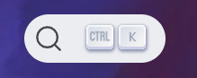

# Touche en CSS



```css
.search-button-key {
    align-items: center;
    background: linear-gradient(-225deg,#d5dbe4,#f8f8f8);
    border-radius: 3px;
    box-shadow: inset 0 -2px 0 0 #cdcde6,inset 0 0 1px 1px #fff,0 1px 2px 1px rgba(30,35,90,0.4);
    color: #969faf;
    display: flex;
    height: 18px;
    justify-content: center;
    margin-right: .4em;
    position: relative;
    padding: 0 0 2px;
    border: 0;
    top: -1px;
    width: 20px;
}
```

```html
<div class="navbarSearchContainer_UZ1U">
    <button type="button" class="DocSearch DocSearch-Button" aria-label="Search">
        <span class="DocSearch-Button-Container"><span class="DocSearch-Button-Placeholder">Search</span></span>
        <span class="DocSearch-Button-Keys"><kbd class="DocSearch-Button-Key"></kbd><kbd class="DocSearch-Button-Key">K</kbd></span>
    </button>
</div>
```

Exemple : https://yarnpkg.com/ > Moteur de recherche