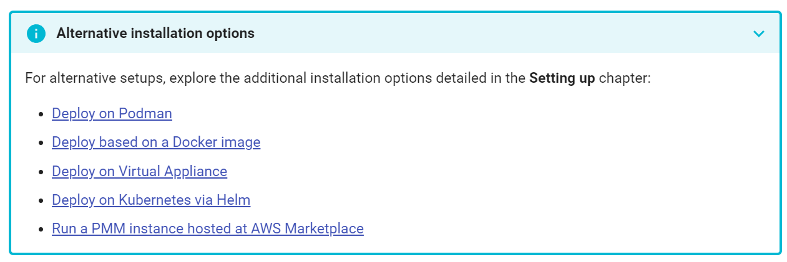

# Exemple de `<details>` custom




```html
<details class="info" open="">
<summary>Alternative installation options</summary>
<p>For alternative setups, explore the additional installation options detailed in the <strong>Setting up</strong> chapter:</p>
<ul>
<li><a href="../setting-up/server/podman.html">Deploy on Podman</a></li>
<li><a href="../setting-up/server/docker.html">Deploy based on a Docker image</a></li>
<li><a href="../setting-up/server/virtual-appliance.html">Deploy on Virtual Appliance</a></li>
<li><a href="../setting-up/server/helm.html">Deploy on Kubernetes via Helm</a></li>
<li><a href="../setting-up/server/aws.html">Run a PMM instance hosted at AWS Marketplace</a></li>
</ul>
</details>
```

```css
    text-size-adjust: none;
    --md-typeset-table-sort-icon: url('data:image/svg+xml;charset=utf-8,<svg xmlns="http://www.w3.org/2000/svg" viewBox="0 0 24 24"><path d="m18 21-4-4h3V7h-3l4-4 4 4h-3v10h3M2 19v-2h10v2M2 13v-2h7v2M2 7V5h4v2H2Z"/></svg>');
    --md-typeset-table-sort-icon--asc: url('data:image/svg+xml;charset=utf-8,<svg xmlns="http://www.w3.org/2000/svg" viewBox="0 0 24 24"><path d="M19 17h3l-4 4-4-4h3V3h2M2 17h10v2H2M6 5v2H2V5m0 6h7v2H2v-2Z"/></svg>');
    --md-typeset-table-sort-icon--desc: url('data:image/svg+xml;charset=utf-8,<svg xmlns="http://www.w3.org/2000/svg" viewBox="0 0 24 24"><path d="M19 7h3l-4-4-4 4h3v14h2M2 17h10v2H2M6 5v2H2V5m0 6h7v2H2v-2Z"/></svg>');
    --md-clipboard-icon: url('data:image/svg+xml;charset=utf-8,<svg xmlns="http://www.w3.org/2000/svg" viewBox="0 0 24 24"><path d="M19 21H8V7h11m0-2H8a2 2 0 0 0-2 2v14a2 2 0 0 0 2 2h11a2 2 0 0 0 2-2V7a2 2 0 0 0-2-2m-3-4H4a2 2 0 0 0-2 2v14h2V3h12V1Z"/></svg>');
    --md-nav-icon--prev: url('data:image/svg+xml;charset=utf-8,<svg xmlns="http://www.w3.org/2000/svg" viewBox="0 0 24 24"><path d="M20 11v2H8l5.5 5.5-1.42 1.42L4.16 12l7.92-7.92L13.5 5.5 8 11h12Z"/></svg>');
    --md-nav-icon--next: url('data:image/svg+xml;charset=utf-8,<svg xmlns="http://www.w3.org/2000/svg" viewBox="0 0 24 24"><path d="M8.59 16.58 13.17 12 8.59 7.41 10 6l6 6-6 6-1.41-1.42Z"/></svg>');
    --md-toc-icon: url('data:image/svg+xml;charset=utf-8,<svg xmlns="http://www.w3.org/2000/svg" viewBox="0 0 24 24"><path d="M3 9h14V7H3v2m0 4h14v-2H3v2m0 4h14v-2H3v2m16 0h2v-2h-2v2m0-10v2h2V7h-2m0 6h2v-2h-2v2Z"/></svg>');
    --md-progress-value: 0;
    --md-progress-delay: 400ms;
    --md-search-result-icon: url('data:image/svg+xml;charset=utf-8,<svg xmlns="http://www.w3.org/2000/svg" viewBox="0 0 24 24"><path d="M14 2H6a2 2 0 0 0-2 2v16a2 2 0 0 0 2 2h7c-.41-.25-.8-.56-1.14-.9-.33-.33-.61-.7-.86-1.1H6V4h7v5h5v1.18c.71.16 1.39.43 2 .82V8l-6-6m6.31 16.9c1.33-2.11.69-4.9-1.4-6.22-2.11-1.33-4.91-.68-6.22 1.4-1.34 2.11-.69 4.89 1.4 6.22 1.46.93 3.32.93 4.79.02L22 23.39 23.39 22l-3.08-3.1m-3.81.1a2.5 2.5 0 0 1-2.5-2.5 2.5 2.5 0 0 1 2.5-2.5 2.5 2.5 0 0 1 2.5 2.5 2.5 2.5 0 0 1-2.5 2.5Z"/></svg>');
    --md-source-forks-icon: url('data:image/svg+xml;charset=utf-8,<svg xmlns="http://www.w3.org/2000/svg" viewBox="0 0 16 16"><path d="M5 5.372v.878c0 .414.336.75.75.75h4.5a.75.75 0 0 0 .75-.75v-.878a2.25 2.25 0 1 1 1.5 0v.878a2.25 2.25 0 0 1-2.25 2.25h-1.5v2.128a2.251 2.251 0 1 1-1.5 0V8.5h-1.5A2.25 2.25 0 0 1 3.5 6.25v-.878a2.25 2.25 0 1 1 1.5 0ZM5 3.25a.75.75 0 1 0-1.5 0 .75.75 0 0 0 1.5 0Zm6.75.75a.75.75 0 1 0 0-1.5.75.75 0 0 0 0 1.5Zm-3 8.75a.75.75 0 1 0-1.5 0 .75.75 0 0 0 1.5 0Z"/></svg>');
    --md-source-repositories-icon: url('data:image/svg+xml;charset=utf-8,<svg xmlns="http://www.w3.org/2000/svg" viewBox="0 0 16 16"><path d="M2 2.5A2.5 2.5 0 0 1 4.5 0h8.75a.75.75 0 0 1 .75.75v12.5a.75.75 0 0 1-.75.75h-2.5a.75.75 0 0 1 0-1.5h1.75v-2h-8a1 1 0 0 0-.714 1.7.75.75 0 1 1-1.072 1.05A2.495 2.495 0 0 1 2 11.5Zm10.5-1h-8a1 1 0 0 0-1 1v6.708A2.486 2.486 0 0 1 4.5 9h8ZM5 12.25a.25.25 0 0 1 .25-.25h3.5a.25.25 0 0 1 .25.25v3.25a.25.25 0 0 1-.4.2l-1.45-1.087a.249.249 0 0 0-.3 0L5.4 15.7a.25.25 0 0 1-.4-.2Z"/></svg>');
    --md-source-stars-icon: url('data:image/svg+xml;charset=utf-8,<svg xmlns="http://www.w3.org/2000/svg" viewBox="0 0 16 16"><path d="M8 .25a.75.75 0 0 1 .673.418l1.882 3.815 4.21.612a.75.75 0 0 1 .416 1.279l-3.046 2.97.719 4.192a.751.751 0 0 1-1.088.791L8 12.347l-3.766 1.98a.75.75 0 0 1-1.088-.79l.72-4.194L.818 6.374a.75.75 0 0 1 .416-1.28l4.21-.611L7.327.668A.75.75 0 0 1 8 .25Zm0 2.445L6.615 5.5a.75.75 0 0 1-.564.41l-3.097.45 2.24 2.184a.75.75 0 0 1 .216.664l-.528 3.084 2.769-1.456a.75.75 0 0 1 .698 0l2.77 1.456-.53-3.084a.75.75 0 0 1 .216-.664l2.24-2.183-3.096-.45a.75.75 0 0 1-.564-.41L8 2.694Z"/></svg>');
    --md-source-version-icon: url('data:image/svg+xml;charset=utf-8,<svg xmlns="http://www.w3.org/2000/svg" viewBox="0 0 16 16"><path d="M1 7.775V2.75C1 1.784 1.784 1 2.75 1h5.025c.464 0 .91.184 1.238.513l6.25 6.25a1.75 1.75 0 0 1 0 2.474l-5.026 5.026a1.75 1.75 0 0 1-2.474 0l-6.25-6.25A1.752 1.752 0 0 1 1 7.775Zm1.5 0c0 .066.026.13.073.177l6.25 6.25a.25.25 0 0 0 .354 0l5.025-5.025a.25.25 0 0 0 0-.354l-6.25-6.25a.25.25 0 0 0-.177-.073H2.75a.25.25 0 0 0-.25.25ZM6 5a1 1 0 1 1 0 2 1 1 0 0 1 0-2Z"/></svg>');
    --md-status: url('data:image/svg+xml;charset=utf-8,<svg xmlns="http://www.w3.org/2000/svg" viewBox="0 0 24 24"><path d="M11 9h2V7h-2m1 13c-4.41 0-8-3.59-8-8s3.59-8 8-8 8 3.59 8 8-3.59 8-8 8m0-18A10 10 0 0 0 2 12a10 10 0 0 0 10 10 10 10 0 0 0 10-10A10 10 0 0 0 12 2m-1 15h2v-6h-2v6Z"/></svg>');
    --md-status--new: url('data:image/svg+xml;charset=utf-8,<svg xmlns="http://www.w3.org/2000/svg" viewBox="0 0 24 24"><path d="m23 12-2.44-2.78.34-3.68-3.61-.82-1.89-3.18L12 3 8.6 1.54 6.71 4.72l-3.61.81.34 3.68L1 12l2.44 2.78-.34 3.69 3.61.82 1.89 3.18L12 21l3.4 1.46 1.89-3.18 3.61-.82-.34-3.68L23 12m-10 5h-2v-2h2v2m0-4h-2V7h2v6Z"/></svg>');
    --md-status--deprecated: url('data:image/svg+xml;charset=utf-8,<svg xmlns="http://www.w3.org/2000/svg" viewBox="0 0 24 24"><path d="M9 3v1H4v2h1v13a2 2 0 0 0 2 2h10a2 2 0 0 0 2-2V6h1V4h-5V3H9m0 5h2v9H9V8m4 0h2v9h-2V8Z"/></svg>');
    --md-status--encrypted: url('data:image/svg+xml;charset=utf-8,<svg xmlns="http://www.w3.org/2000/svg" viewBox="0 0 24 24"><path d="M12 1 3 5v6c0 5.55 3.84 10.74 9 12 5.16-1.26 9-6.45 9-12V5l-9-4m0 6c1.4 0 2.8 1.1 2.8 2.5V11c.6 0 1.2.6 1.2 1.3v3.5c0 .6-.6 1.2-1.3 1.2H9.2c-.6 0-1.2-.6-1.2-1.3v-3.5c0-.6.6-1.2 1.2-1.2V9.5C9.2 8.1 10.6 7 12 7m0 1.2c-.8 0-1.5.5-1.5 1.3V11h3V9.5c0-.8-.7-1.3-1.5-1.3Z"/></svg>');
    --md-tag-icon: url('data:image/svg+xml;charset=utf-8,<svg xmlns="http://www.w3.org/2000/svg" viewBox="0 0 24 24"><path d="m5.41 21 .71-4h-4l.35-2h4l1.06-6h-4l.35-2h4l.71-4h2l-.71 4h6l.71-4h2l-.71 4h4l-.35 2h-4l-1.06 6h4l-.35 2h-4l-.71 4h-2l.71-4h-6l-.71 4h-2M9.53 9l-1.06 6h6l1.06-6h-6Z"/></svg>');
    --md-annotation-bg-icon: url('data:image/svg+xml;charset=utf-8,<svg xmlns="http://www.w3.org/2000/svg" viewBox="0 0 24 24"><path d="M12 2A10 10 0 0 0 2 12a10 10 0 0 0 10 10 10 10 0 0 0 10-10A10 10 0 0 0 12 2Z"/></svg>');
    --md-annotation-icon: url('data:image/svg+xml;charset=utf-8,<svg xmlns="http://www.w3.org/2000/svg" viewBox="0 0 24 24"><path d="M17 13h-4v4h-2v-4H7v-2h4V7h2v4h4m-5-9A10 10 0 0 0 2 12a10 10 0 0 0 10 10 10 10 0 0 0 10-10A10 10 0 0 0 12 2Z"/></svg>');
    --md-tooltip-width: 20rem;
    --md-version-icon: url('data:image/svg+xml;charset=utf-8,<svg xmlns="http://www.w3.org/2000/svg" viewBox="0 0 320 512"><!--! Font Awesome Free 6.4.2 by @fontawesome - https://fontawesome.com License - https://fontawesome.com/license/free (Icons: CC BY 4.0, Fonts: SIL OFL 1.1, Code: MIT License) Copyright 2023 Fonticons, Inc.--><path d="M137.4 374.6c12.5 12.5 32.8 12.5 45.3 0l128-128c9.2-9.2 11.9-22.9 6.9-34.9S301 191.9 288 191.9L32 192c-12.9 0-24.6 7.8-29.6 19.8s-2.2 25.7 6.9 34.9l128 128z"/></svg>');
    --md-admonition-icon--note: url('data:image/svg+xml;charset=utf-8,<svg xmlns="http://www.w3.org/2000/svg" viewBox="0 0 24 24"><path d="M12 2C6.47 2 2 6.47 2 12s4.47 10 10 10 10-4.47 10-10S17.53 2 12 2m3.1 5.07c.14 0 .28.05.4.16l1.27 1.27c.23.22.23.57 0 .78l-1 1-2.05-2.05 1-1c.1-.11.24-.16.38-.16m-1.97 1.74 2.06 2.06-6.06 6.06H7.07v-2.06l6.06-6.06Z"/></svg>');
    --md-admonition-icon--abstract: url('data:image/svg+xml;charset=utf-8,<svg xmlns="http://www.w3.org/2000/svg" viewBox="0 0 24 24"><path d="M17 9H7V7h10m0 6H7v-2h10m-3 6H7v-2h7M12 3a1 1 0 0 1 1 1 1 1 0 0 1-1 1 1 1 0 0 1-1-1 1 1 0 0 1 1-1m7 0h-4.18C14.4 1.84 13.3 1 12 1c-1.3 0-2.4.84-2.82 2H5a2 2 0 0 0-2 2v14a2 2 0 0 0 2 2h14a2 2 0 0 0 2-2V5a2 2 0 0 0-2-2Z"/></svg>');
    --md-admonition-icon--info: url('data:image/svg+xml;charset=utf-8,<svg xmlns="http://www.w3.org/2000/svg" viewBox="0 0 24 24"><path d="M13 9h-2V7h2m0 10h-2v-6h2m-1-9A10 10 0 0 0 2 12a10 10 0 0 0 10 10 10 10 0 0 0 10-10A10 10 0 0 0 12 2Z"/></svg>');
    --md-admonition-icon--tip: url('data:image/svg+xml;charset=utf-8,<svg xmlns="http://www.w3.org/2000/svg" viewBox="0 0 24 24"><path d="M17.66 11.2c-.23-.3-.51-.56-.77-.82-.67-.6-1.43-1.03-2.07-1.66C13.33 7.26 13 4.85 13.95 3c-.95.23-1.78.75-2.49 1.32-2.59 2.08-3.61 5.75-2.39 8.9.04.1.08.2.08.33 0 .22-.15.42-.35.5-.23.1-.47.04-.66-.12a.58.58 0 0 1-.14-.17c-1.13-1.43-1.31-3.48-.55-5.12C5.78 10 4.87 12.3 5 14.47c.06.5.12 1 .29 1.5.14.6.41 1.2.71 1.73 1.08 1.73 2.95 2.97 4.96 3.22 2.14.27 4.43-.12 6.07-1.6 1.83-1.66 2.47-4.32 1.53-6.6l-.13-.26c-.21-.46-.77-1.26-.77-1.26m-3.16 6.3c-.28.24-.74.5-1.1.6-1.12.4-2.24-.16-2.9-.82 1.19-.28 1.9-1.16 2.11-2.05.17-.8-.15-1.46-.28-2.23-.12-.74-.1-1.37.17-2.06.19.38.39.76.63 1.06.77 1 1.98 1.44 2.24 2.8.04.14.06.28.06.43.03.82-.33 1.72-.93 2.27Z"/></svg>');
    --md-admonition-icon--success: url('data:image/svg+xml;charset=utf-8,<svg xmlns="http://www.w3.org/2000/svg" viewBox="0 0 24 24"><path d="M21 7 9 19l-5.5-5.5 1.41-1.41L9 16.17 19.59 5.59 21 7Z"/></svg>');
    --md-admonition-icon--question: url('data:image/svg+xml;charset=utf-8,<svg xmlns="http://www.w3.org/2000/svg" viewBox="0 0 24 24"><path d="m15.07 11.25-.9.92C13.45 12.89 13 13.5 13 15h-2v-.5c0-1.11.45-2.11 1.17-2.83l1.24-1.26c.37-.36.59-.86.59-1.41a2 2 0 0 0-2-2 2 2 0 0 0-2 2H8a4 4 0 0 1 4-4 4 4 0 0 1 4 4 3.2 3.2 0 0 1-.93 2.25M13 19h-2v-2h2M12 2A10 10 0 0 0 2 12a10 10 0 0 0 10 10 10 10 0 0 0 10-10c0-5.53-4.5-10-10-10Z"/></svg>');
    --md-admonition-icon--warning: url('data:image/svg+xml;charset=utf-8,<svg xmlns="http://www.w3.org/2000/svg" viewBox="0 0 24 24"><path d="M13 14h-2V9h2m0 9h-2v-2h2M1 21h22L12 2 1 21Z"/></svg>');
    --md-admonition-icon--failure: url('data:image/svg+xml;charset=utf-8,<svg xmlns="http://www.w3.org/2000/svg" viewBox="0 0 24 24"><path d="M19 6.41 17.59 5 12 10.59 6.41 5 5 6.41 10.59 12 5 17.59 6.41 19 12 13.41 17.59 19 19 17.59 13.41 12 19 6.41Z"/></svg>');
    --md-admonition-icon--danger: url('data:image/svg+xml;charset=utf-8,<svg xmlns="http://www.w3.org/2000/svg" viewBox="0 0 24 24"><path d="m11.5 20 4.86-9.73H13V4l-5 9.73h3.5V20M12 2c2.75 0 5.1 1 7.05 2.95C21 6.9 22 9.25 22 12s-1 5.1-2.95 7.05C17.1 21 14.75 22 12 22s-5.1-1-7.05-2.95C3 17.1 2 14.75 2 12s1-5.1 2.95-7.05C6.9 3 9.25 2 12 2Z"/></svg>');
    --md-admonition-icon--bug: url('data:image/svg+xml;charset=utf-8,<svg xmlns="http://www.w3.org/2000/svg" viewBox="0 0 24 24"><path d="M11 13h2v1h-2v-1m10-8v6c0 5.5-3.8 10.7-9 12-5.2-1.3-9-6.5-9-12V5l9-4 9 4m-4 5h-2.2c-.2-.6-.6-1.1-1.1-1.5l1.2-1.2-.7-.7L12.8 8H12c-.2 0-.5 0-.7.1L9.9 6.6l-.8.8 1.2 1.2c-.5.3-.9.8-1.1 1.4H7v1h2v1H7v1h2v1H7v1h2.2c.4 1.2 1.5 2 2.8 2s2.4-.8 2.8-2H17v-1h-2v-1h2v-1h-2v-1h2v-1m-6 2h2v-1h-2v1Z"/></svg>');
    --md-admonition-icon--example: url('data:image/svg+xml;charset=utf-8,<svg xmlns="http://www.w3.org/2000/svg" viewBox="0 0 24 24"><path d="M7 2v2h1v14a4 4 0 0 0 4 4 4 4 0 0 0 4-4V4h1V2H7m4 14c-.6 0-1-.4-1-1s.4-1 1-1 1 .4 1 1-.4 1-1 1m2-4c-.6 0-1-.4-1-1s.4-1 1-1 1 .4 1 1-.4 1-1 1m1-5h-4V4h4v3Z"/></svg>');
    --md-admonition-icon--quote: url('data:image/svg+xml;charset=utf-8,<svg xmlns="http://www.w3.org/2000/svg" viewBox="0 0 24 24"><path d="M14 17h3l2-4V7h-6v6h3M6 17h3l2-4V7H5v6h3l-2 4Z"/></svg>');
    --md-footnotes-icon: url('data:image/svg+xml;charset=utf-8,<svg xmlns="http://www.w3.org/2000/svg" viewBox="0 0 24 24"><path d="M19 7v4H5.83l3.58-3.59L8 6l-6 6 6 6 1.41-1.42L5.83 13H21V7h-2Z"/></svg>');
    --md-details-icon: url('data:image/svg+xml;charset=utf-8,<svg xmlns="http://www.w3.org/2000/svg" viewBox="0 0 24 24"><path d="M8.59 16.58 13.17 12 8.59 7.41 10 6l6 6-6 6-1.41-1.42Z"/></svg>');
    --md-tabbed-icon--prev: url('data:image/svg+xml;charset=utf-8,<svg xmlns="http://www.w3.org/2000/svg" viewBox="0 0 24 24"><path d="M15.41 16.58 10.83 12l4.58-4.59L14 6l-6 6 6 6 1.41-1.42Z"/></svg>');
    --md-tabbed-icon--next: url('data:image/svg+xml;charset=utf-8,<svg xmlns="http://www.w3.org/2000/svg" viewBox="0 0 24 24"><path d="M8.59 16.58 13.17 12 8.59 7.41 10 6l6 6-6 6-1.41-1.42Z"/></svg>');
    --md-tasklist-icon: url('data:image/svg+xml;charset=utf-8,<svg xmlns="http://www.w3.org/2000/svg" viewBox="0 0 24 24"><path d="M1 12C1 5.925 5.925 1 12 1s11 4.925 11 11-4.925 11-11 11S1 18.075 1 12Zm16.28-2.72a.751.751 0 0 0-.018-1.042.751.751 0 0 0-1.042-.018l-5.97 5.97-2.47-2.47a.751.751 0 0 0-1.042.018.751.751 0 0 0-.018 1.042l3 3a.75.75 0 0 0 1.06 0Z"/></svg>');
    --md-tasklist-icon--checked: url('data:image/svg+xml;charset=utf-8,<svg xmlns="http://www.w3.org/2000/svg" viewBox="0 0 24 24"><path d="M1 12C1 5.925 5.925 1 12 1s11 4.925 11 11-4.925 11-11 11S1 18.075 1 12Zm16.28-2.72a.751.751 0 0 0-.018-1.042.751.751 0 0 0-1.042-.018l-5.97 5.97-2.47-2.47a.751.751 0 0 0-1.042.018.751.751 0 0 0-.018 1.042l3 3a.75.75 0 0 0 1.06 0Z"/></svg>');
    --md-text-font: "Roboto";
    --md-code-font: "Roboto Mono";
    --fHeading: "Poppins", "Roboto", Arial, Helvetica, sans-serif;
    --white: #fff;
    --night500: #0E1A53;
    --night400: #3E4875;
    --night300: #5E668C;
    --aqua900: #14584B;
    --aqua800: #1A7362;
    --aqua700: #22947E;
    --aqua600: #2CBEA2;
    --sky900: #08386B;
    --sky800: #0B4A8C;
    --sky700: #0E5FB5;
    --sky600: #127AE8;
    --sky500: #1486FF;
    --sky400: #439EFF;
    --sky300: #62AEFF;
    --sky200: #93C7FF;
    --stone900: #2C323E;
    --stone800: #3A4151;
    --stone700: #4B5468;
    --stone100: #D1D5DE;
    --stone50: #F0F1F4;
    -webkit-font-smoothing: antialiased;
    --md-text-font-family: var(--md-text-font,_),-apple-system,BlinkMacSystemFont,Helvetica,Arial,sans-serif;
    --md-code-font-family: var(--md-code-font,_),SFMono-Regular,Consolas,Menlo,monospace;
    font-feature-settings: "kern","liga";
    font-family: var(--md-text-font-family);
    color-scheme: light;
    --md-hue: 225deg;
    --md-default-fg-color: #000000de;
    --md-default-fg-color--light: #0000008a;
    --md-default-fg-color--lighter: #00000052;
    --md-default-fg-color--lightest: #00000012;
    --md-default-bg-color: #fff;
    --md-default-bg-color--light: #ffffffb3;
    --md-default-bg-color--lighter: #ffffff4d;
    --md-default-bg-color--lightest: #ffffff1f;
    --md-code-fg-color: #36464e;
    --md-code-bg-color: #f5f5f5;
    --md-code-hl-color: #4287ff;
    --md-code-hl-color--light: #4287ff1a;
    --md-code-hl-number-color: #d52a2a;
    --md-code-hl-special-color: #db1457;
    --md-code-hl-function-color: #a846b9;
    --md-code-hl-constant-color: #6e59d9;
    --md-code-hl-keyword-color: #3f6ec6;
    --md-code-hl-string-color: #1c7d4d;
    --md-code-hl-name-color: var(--md-code-fg-color);
    --md-code-hl-operator-color: var(--md-default-fg-color--light);
    --md-code-hl-punctuation-color: var(--md-default-fg-color--light);
    --md-code-hl-comment-color: var(--md-default-fg-color--light);
    --md-code-hl-generic-color: var(--md-default-fg-color--light);
    --md-code-hl-variable-color: var(--md-default-fg-color--light);
    --md-typeset-color: var(--md-default-fg-color);
    --md-typeset-a-color: var(--md-primary-fg-color);
    --md-typeset-del-color: #f5503d26;
    --md-typeset-ins-color: #0bd57026;
    --md-typeset-kbd-color: #fafafa;
    --md-typeset-kbd-accent-color: #fff;
    --md-typeset-kbd-border-color: #b8b8b8;
    --md-typeset-mark-color: #ffff0080;
    --md-typeset-table-color: #0000001f;
    --md-typeset-table-color--light: rgba(0,0,0,.035);
    --md-warning-fg-color: #000000de;
    --md-warning-bg-color: #ff9;
    --md-footer-fg-color: #fff;
    --md-footer-fg-color--light: #ffffffb3;
    --md-footer-fg-color--lighter: #ffffff73;
    --md-footer-bg-color: #000000de;
    --md-footer-bg-color--dark: #00000052;
    --md-shadow-z1: 0 0.2rem 0.5rem #0000000d,0 0 0.05rem #0000001a;
    --md-shadow-z2: 0 0.2rem 0.5rem #0000001a,0 0 0.05rem #00000040;
    --md-shadow-z3: 0 0.2rem 0.5rem #0003,0 0 0.05rem #00000059;
    --md-mermaid-font-family: var(--md-text-font-family),sans-serif;
    --md-mermaid-edge-color: var(--md-code-fg-color);
    --md-mermaid-node-bg-color: var(--md-accent-fg-color--transparent);
    --md-mermaid-node-fg-color: var(--md-accent-fg-color);
    --md-mermaid-label-bg-color: var(--md-default-bg-color);
    --md-mermaid-label-fg-color: var(--md-code-fg-color);
    --md-mermaid-sequence-actor-bg-color: var(--md-mermaid-label-bg-color);
    --md-mermaid-sequence-actor-fg-color: var(--md-mermaid-label-fg-color);
    --md-mermaid-sequence-actor-border-color: var(--md-mermaid-node-fg-color);
    --md-mermaid-sequence-actor-line-color: var(--md-default-fg-color--lighter);
    --md-mermaid-sequence-actorman-bg-color: var(--md-mermaid-label-bg-color);
    --md-mermaid-sequence-actorman-line-color: var(--md-mermaid-node-fg-color);
    --md-mermaid-sequence-box-bg-color: var(--md-mermaid-node-bg-color);
    --md-mermaid-sequence-box-fg-color: var(--md-mermaid-edge-color);
    --md-mermaid-sequence-label-bg-color: var(--md-mermaid-node-bg-color);
    --md-mermaid-sequence-label-fg-color: var(--md-mermaid-node-fg-color);
    --md-mermaid-sequence-loop-bg-color: var(--md-mermaid-node-bg-color);
    --md-mermaid-sequence-loop-fg-color: var(--md-mermaid-edge-color);
    --md-mermaid-sequence-loop-border-color: var(--md-mermaid-node-fg-color);
    --md-mermaid-sequence-message-fg-color: var(--md-mermaid-edge-color);
    --md-mermaid-sequence-message-line-color: var(--md-mermaid-edge-color);
    --md-mermaid-sequence-note-bg-color: var(--md-mermaid-label-bg-color);
    --md-mermaid-sequence-note-fg-color: var(--md-mermaid-edge-color);
    --md-mermaid-sequence-note-border-color: var(--md-mermaid-label-fg-color);
    --md-mermaid-sequence-number-bg-color: var(--md-mermaid-node-fg-color);
    --md-mermaid-sequence-number-fg-color: var(--md-accent-bg-color);
    --md-accent-fg-color: #526cfe;
    --md-accent-fg-color--transparent: #526cfe1a;
    --md-accent-bg-color: #fff;
    --md-accent-bg-color--light: #ffffffb3;
    --md-primary-fg-color: #4051b5;
    --md-primary-fg-color--light: #5d6cc0;
    --md-primary-fg-color--dark: #303fa1;
    --md-primary-bg-color: #fff;
    --md-primary-bg-color--light: #ffffffb3;
    -webkit-print-color-adjust: exact;
    line-height: 1.5;
    box-sizing: inherit;
    background-color: var(--md-admonition-bg-color);
    border: .075rem solid #448aff;
    border-radius: .2rem;
    color: var(--md-admonition-fg-color);
    font-size: .64rem;
    margin: 1.5625em 0;
    padding: 0 .6rem;
    page-break-inside: avoid;
    transition: box-shadow 125ms;
    display: flow-root;
    overflow: visible;
    padding-top: 0;
    --md-admonition-bg-color: var(--md-default-bg-color);
    --md-admonition-fg-color: var(--md-typeset-color);
    border-width: 0.1125rem;
    box-shadow: none;
    border-color: #00b8d4;
```

Source : https://docs.percona.com/percona-monitoring-and-management/quickstart/index.html