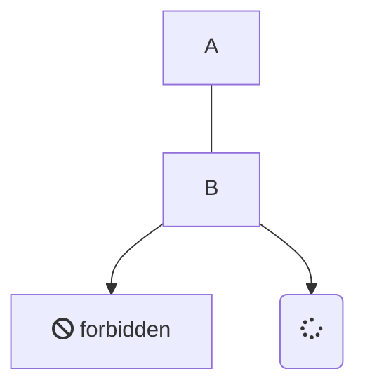
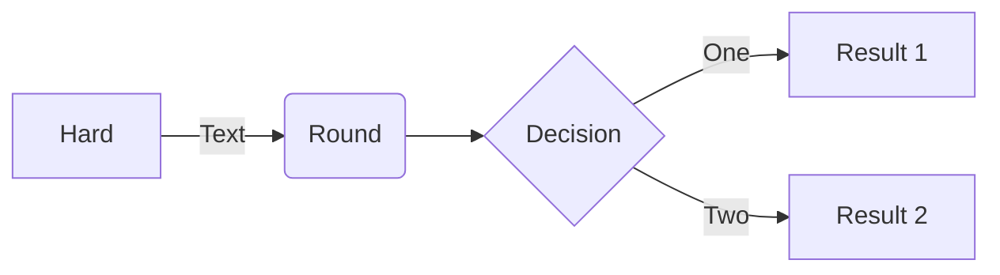

# EXEMPLE : MERMAID

```mermaid
graph TB
    A --- B
    B-->C[fa:fa-ban forbidden]
    B-->D(fa:fa-spinner);
```

```mermaid
flowchart LR

A[Hard] -->|Text| B(Round)
B --> C{Decision}
C -->|One| D[Result 1]
C -->|Two| E[Result 2]
```