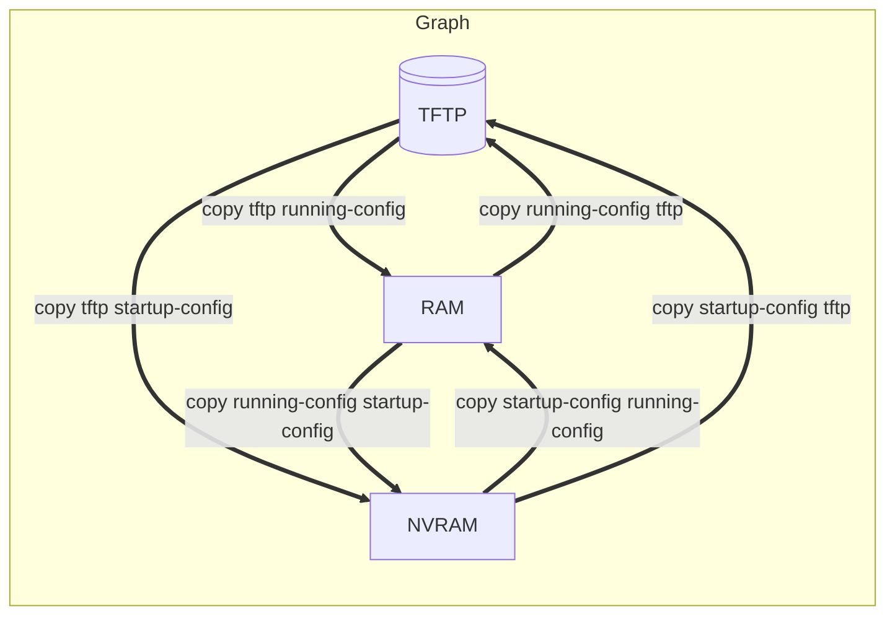

# MEMO - CISCO - NOTIONS DE BASE SUR LES RESEAU

Préparation au module 1 de la certification CCNA 200-120

## Séquence de démarrage du périphérique

<table>
<tr>
    <td style="background-color:red;width:100px;text-align:center;">ROM</td>
    <td style="width:100px;text-align:center;">--></td>
    <td style="background-color:red;width:150px;text-align:center;">POST</td>
    <td style="width:300px;text-align:center;">Tests POST</td>
</tr>
<tr>
    <td style="background-color:red;width:100px;text-align:center;">ROM</td>
    <td style="width:100px;text-align:center;">--></td>
    <td style="background-color:red;width:150px;text-align:center;">Bootstrap</td>
    <td style="width:300px;text-align:center;">Chargement du Bootstrap</td>
</tr>
</table>

<table>
<tr>
    <td style="background-color:yellow;width:100px;text-align:center;">Flash</td>
    <td style="width:100px;text-align:center;">--></td>
    <td rowspan="2" style="background-color:yellow;width:150px;text-align:center;">IOS</td>
    <td rowspan="2" style="width:300px;text-align:center;">Recherche + Chargement ISO</td>
</tr>
<tr>
    <td style="background-color:yellow;width:100px;text-align:center;">TFTP</td>
    <td style="width:100px;text-align:center;">--></td>
</tr>
</table>

<table>
<tr>
    <td style="background-color:green;width:100px;text-align:center;">NVRAM</td>
    <td style="width:100px;text-align:center;">--></td>
    <td rowspan="3" style="background-color:green;width:150px;text-align:center;">Configuration</td>
    <td rowspan="3" style="width:300px;text-align:center;">Recherche + Chargement du fichier de configuration (ou mode de configuration)</td>
</tr>
<tr>
    <td style="background-color:green;width:100px;text-align:center;">TFTP</td>
    <td style="width:100px;text-align:center;">--></td>
</tr>
<tr>
    <td style="background-color:green;width:100px;text-align:center;">Console</td>
    <td style="width:100px;text-align:center;">--></td>
</tr>
</table>

---

## Navigation dans les modes de configuration de Cisco IOS

|Commande|Description|
|--------|-----------|
|`Router>`|Prompt du mode utilisateur|
|`Router>enable `|Bascule du mode utilisateur au mode privilégié.|
|`Router# `|Prompt du mode privilégié.|
|`Router#disable `|Bascule du mode privilégié au mode utilisateur|
|`Router#configure terminal`|Bascule en mode privilégié au mode de configuration globale.|
|`Router(config)#`|Prompt du mode de configuration globale.|
|`Router(config)#end` (ou <kbd>CTRL</kbd>+<kbd>Z</kbd>)|Permet de sortir du mode de configuration globale ou d'un mode de configuration spécifique et de revenir au mode privilégié.|
|`Router(config)#line console 0 `|Bascule du mode de configuration globale au mode de configuration de ligne spécifié (ici console).|
|`Router(config-line)# `|Prompt du mode de configuration de ligne.|

---

## Raccourci-clavier

|Raccourci-clavier|Description|
|-----------------|-----------|
|<kbd>CTRL</kbd> + <kbd>A</kbd>|Déplace le curseur sur le premier caractère de la commande affichée sans effacer cette dernière.|
|<kbd>CTRL</kbd> + <kbd>C</kbd>|Supprime la commande affichée pour en saisir une nouvelle. Permet également de quitter le mode de configuration|
|<kbd>CTRL</kbd> + <kbd>D</kbd>|Supprimer un caractère à l'emplacement du curseur.|
|<kbd>CTRL</kbd> + <kbd>E</kbd>|Déplace le curseur sur le dernier caractère de la commande affichée sans effacer cette dernière.|
|<kbd>CTRL</kbd> + <kbd>K</kbd>|Efface tous les caractères à partir du curseur jusqu'à la fin de la ligne de commande.|
|<kbd>CTRL</kbd> + <kbd>R</kbd>|Rappelle la dernière ligne de commande interrompue par la réception d'un message ISO.|
|<kbd>CTRL</kbd> + <kbd>U</kbd> ou <kbd>CTRL</kbd> + <kbd>X</kbd>|Efface tous les caractères à partir du curseur jusqu'au début de la ligne de commande.|
|<kbd>CTRL</kbd> + <kbd>W</kbd>|Efface le mot à gauche du curseur.|
|<kbd>CTRL</kbd> + <kbd>Z</kbd>|Permet, à partir du mode de configuration globale, de revenir au code d'exécution privilégié.|
|<kbd>CTRL</kbd><kbd>&#8593; Shift</kbd> + <kbd>9 (azerty)</kbd>|Interrompt la recherche d'une erreur de saisie de commande soumise à la résolution de noms DNS ou bien un processus IOS tel `ping` ou `traceroute`.|
|<kbd>Echap</kbd> + <kbd>B</kbd>|Déplace le curseur d'un mot vers la gauche.|
|<kbd>Echap</kbd> + <kbd>F</kbd>|Déplace le curseur d'un mot vers la droite.|

---

## Configuration initiale du routeur et du commutateur

|Commande|Description|
|--------|-----------|
|`(config)#hostname name`|Attribue un nom d'hôte au périphérique.|
|`(config)#no hostname`|Supprime le nom d'hôte attribué au périphérique et redéfinit le nom d'hôte par défaut.|
|`(config)#enable secret password`|Définit un mot de passe et active sa demande lors du passage au mode d'exécution privilégié. Le mot de passe sera stocké chiffré.|
|`(config)#banner motd # Message #`|Définit et active une bannière d'information ponctuelle de type MOTD _(Message Of The Day)_ lors d'un accès au périphérique avant la phase d'authentification.|
|`(config)#no ip domain-lookup`|Désactive la tentative de résolution de noms via le service DNS lors de la saisie erronée d'une commande.|
|`(config)#line {console 0 \| vty0 15}`|Bascule du mode de configuration globale au mode de configuration de ligne (port console ou terminaux virtuels VTY).|
|`(config-line)#password password`|Définit un mot de passe pour protéger l'accès au port console ou aux ports VTY.|
|`(config-line)#login`|Active la demande de saisie de mot de passe pour l'accès au port console ou aux ports VTY.|
|`(config-line)#no login`|Désactive la demande de saisie de mot de passe pour l'accès au port console ou aux ports VTY.|
|`(config-line)#exec-timeout minutes [seconds]`|Déconnecte automatiquement tout utilisateur en ligne en cas d'inactivité pendant le délai défini.|
|`(config-line)#logging synchronous`|Synchronise l'affichage des messages ISO avec la saisie des commandes.|

---

## Configuration du commutateur

|Commande|Description|
|--------|-----------|
|`(config-if)#duplex {full \| half \| auto}`|Définit le mode de communication bidirectionnel du port sélectionné.|
|`(config-if)#speed {10 \| 100 \| 1000 \| auto}`|Configure la vitesse (en Mbit/s) du port sélectionné.|
|`(config-if)#mdix auto`|Active la détection automatique du type de câble utilisé (droit ou croisé) et configure le port en conséquence.|
|`(config-if)#no switchport`|Configure le port sélectionné en tant que port routé.|
|`(config)#interface vlan number`|Créé l'interface SVI (Switch Virtual Interface) avec le numéro spécifié et bascule dans le mode correspondant.|
|`(config)#ip default-gateway ip-address`|Définit une passerelle par défaut sur un commutateur.|
|`#erase startup-config`|Supprime le fichier de configuration initiale.|
|`#delete flash:vlan.dat`|Supprime la base de données des VLAN.|

---

## Historique des commandes

|Commande|Description|
|--------|-----------|
|`#show history`|Affiche l'historique des commandes exécutées.|
|`#terminal history`|Affiche l'historique de commandes (par défaut, 10 lignes).|
|`#terminal no history`|Désactive l'historique de commandes.|
|`#terminal history size x`|Définit la taille du tampon d'historique de commandes.|
|`#terminal no history size`|Rétablit la valeur par défaut de l'historique de commandes.|
|`(config-line)#history size x`|Définit la taille du tampon d'historique de commandes uniquement pour le mode de ligne sélectionné.|

---

## Normes Ethernet

|Vitesse|Nom|Nom IEEE|Code IEEE|Type de câble Longueur max.|
|-------|---|--------|---------|----------------------------|
|10 Mbps|Ethernet|10BASE-T|802.3|Cuivre - 100m|
|100 Mbps|Fast Ethernet|100BASE-T|802.3u|Cuivre - 100m|
|1000 Mbps|Gigabit Ethernet|1000BASE-LX|802.3z|Fibre - 5000m|
|1000 Mbps|Gigabit Ethernet|1000BASE-T|802.3ab|Cuivre - 100m|
|10 Gbps|10 Gigabit Ethernet|10GBASE-T|802.3an|Cuivre - 100m|

---

## Caractéristiques des périphériques de segmentation Ethernet

|Caractéristiques|Concentrateur (Hub)|Commutateur (Switch)|Routeur|
|----------------|:-----------------:|:------------------:|:-----:|
|Couche 1 du modèle OSI|Oui|Oui|Oui|
|Couche 2 du modèle OSI|Non|Oui|Oui|
|Couche 3 du modèle OSI|Non|Non*|Oui|
|Accroît la distance de câblage autorisée|Oui|Oui|Oui|
|Sépare le réseau en domaine de collision|Non|Oui|Oui|
|Accroît la bande passante du réseau|Non|Oui|Oui|
|Sépare le réseau en domaines de diffusion|Non|Non*|Oui|
_*seul s'il s'agit d'un commutateur de couche 3._

## Gestion des fichiers de configuration

|Mémoire|Fichier(s) stocké(s)|Type|
|:-----:|:-------------------|:--:|
|Flash|Système d'exploitation IOS et autres fichiers système.|Non volatile|
|NVRAM|Fichier de configuration initiale _(startup-config)_.|Non volatile|
|RAM|Fichier de configuration en cours _(running-config)_, Tables ARP et de routage IP, Mémoire tampon de paquets IP.|Volatile|
|ROM|Programme Bootstrap, Version limitée de l'IOS.|Non volatile|

|Commande|Description|
|--------|-----------|
|`#show {startup-config \| running-config}`|Affiche le contenu du fichier de configuration|
|`#copy system:running-config nvram:startup-config`|Sauvegarde le fichier de configuration en cours vers la NVRAM|
|`#copy {startup-config \| running-config} tftp`|Sauvegarde le fichier de configuration sur un serveur TFTP.|
|`#copy tftp {startup-config \| running-config}`|Restaure le fichier de configuration depuis un serveur TFTP.|
|`#copy {startup-config \| running-config} usbflash0:/Routeur1-cfg`|Copie le fichier de configuration vers une clé USB en FAT16|
|`#copy usbflash0:/Routeur1-cfg {startup-config \| running-config}`|Restaure le fichier de configuration depuis une clé USB.|
|`#erase {nvram: \| startup-config}`|Supprime le fichier de configuration initiale.|
|`#reload`|Redémarre le périphérique.|

---

## Diagnostic

|Commande|Description|
|--------|-----------|
|`show version`|Affiche l'état et les caractéristiques matérielles et logicielles du système.|
|`show file systems`|Répertorie tous les systèmes de fichiers disponibles. Les commandes UNIX suivantes permettent ensuite de gérer le système de fichiers : `cd`,`pwd`,`dir`,`erase`,`copy`,`more`...|
|`show ip arp`|Affiche la table ARP du périphérique.|
|`show cdp neighbors [details]`|Affiche la liste des périphériques CDP voisins.|

---

## Sécurisation de l'accès au périphérique

|Commande|Description|
|--------|-----------|
|`(config)#service password-encryption`|Genère le chiffrement de tous les mots de passe en clair stockés dans les fichiers de configuration.|
|`(config)#enable secret password`|Définit le mot de passe et active sa demande lors du passage au mode d'exécution privilégié. Le mot de passe sera stocké chiffré.|
|`(config)#security passwords min-length`|Impose une longueur minimale des mots de passe|
|`(config)#login block-for seconds attemps tries within seconds`|Bloque les tentatives de connexion au périphérique pendant une période définie si un nombre donnée d'échecs survient pendant une certaine période.|
|`(config)#ip domain-name domain-name`|Définit un nom de domaine pour le protocole SSH.|
|`(config)#crypto key generate rsa`|Genère des clés de chiffrement pour sécuriser la connexion SSH (clés de 1024 bits minimum recommandées).|
|`(config)#username name secret password`|Crée un compte d'utilisateur et le mot de passe associé dans la base de données locale du périphérique.|
|`(config)#line vty 0 15`|Bascule du mode de configuration globale au mode de configuration de ligne pour les terminaux virtuels VTY.|
|`(config)#login local`|Active l'authentification locale pour les tentatives de connexion SSH.|
|`(config)#transport input ssh`|Impose l'accès au périphérique via SSH, désactive celui via Telnet.|
|`(config)#no cdp run`|Désactive globalement le protocole CDP _(Cisco Discovery Protocol)_ sur le périphérique.|
|`(config-if)#no cdp enable`|Désactive le protocole CDP sur l'interface sélectionnée.|

---

## Couches du modèle OSI

<table>
<tr>
    <th>Modèle OSI RM</th>
    <th>Suite protocole TCP/IP</th>
    <th>Modèle TCP/IP</th>
</tr>
<tr>
    <td>Application</td>
    <td rowspan="3">HTTP, DNS, DHCP, FTP</td>
    <td rowspan="3">Application</td>
</tr>
<tr>
    <td>Présentation</td>
</tr>
<tr>
    <td>Session</td>
</tr>
<tr>
    <td>Transport</td>
    <td>TCP, UDP</td>
    <td>Transport</td>
</tr>
<tr>
    <td>Réseau</td>
    <td>IPv4 et v6, ICMPv4 et v6</td>
    <td>Internet</td>
</tr>
<tr>
    <td>Liaison de données</td>
    <td rowspan="2">Ethernet, PPP, Frame Relay</td>
    <td rowspan="2">Accès réseau</td>
</tr>
<tr>
    <td>Physique</td>
</tr>
</table>

|Protocole L4|N° de port|Application|
|------------|:--------:|:---------:|
|TCP|20|FTP Data|
|TCP|21|FTP Control|
|TCP|22|SSH|
|TCP|23|Telnet|
|TCP|25|SMTP|
|TCP et UDP|53|DNS|
|UDP|67, 68|DHCP|
|UDP|69|TFTP|
|TCP|80|HTTP|
|TCP|110|POP3|
|UDP|161|SNMP|
|TCP|443|HTTPS|

<table style="text-align:center;">
<tr>
    <th>Couche OSI</th>
    <th>Nom du PDU <i>(Procotol Data Unit)</i></th>
</tr>
<tr>
    <td>Application</td>
    <td rowspan="3">Donnée</td>
</tr>
<tr>
    <td>Présentation</td>
</tr>
<tr>
    <td>Session</td>
</tr>
<tr>
    <td>Transport</td>
    <td>Segment TCP, datagramme UDP</td>
</tr>
<tr>
    <td>Réseau</td>
    <td>Paquet ou datagramme IP</td>
</tr>
<tr>
    <td>Liaison</td>
    <td>Trame</td>
</tr>
<tr>
    <td>Physique</td>
    <td>Bit</td>
</tr>
</table>

---

## Configuration d'interface

|Commande|Description|
|--------|-----------|
|`(config)#interface intf-type intf-number`|Bascule du mode de configuration globale au mode de configuration de l'interface sélectionnée.|
|`(config-if)#description text`|Définit une description sur l'interface sélectionnée.|
|`(config-if)#clock rate clock-frequence`|Configure l'interface série sélectionnée en tant que DCE _(Data Circuit Equipment)_ avec la fréquence d'horloge spécifiée (en bauds).|
|`(config-if)#no shutdown`|Active l'interface sélectionnée.|
|`(config-if)#shutdown`|Désactive l'interface sélectionnée.|
|`(config)#interface loopback intf-number`|Crée et active une interface virtuelle de loopback.|

---

## Configuration IPv4 et IPv6

|Commande|Description|
|--------|-----------|
|`(config-if)#ip address ip-address subnet-mask`|Définit une configuration IPv4 sur l'interface sélectionnée.|
|`(config-if)#ipv6 address ipv6-address/prefix-length [link-local \| eui-64]`|Configure manuellement une adresse IPv6 de monodiffusion globale aléatoire ou via le processus EUI-64, ou bien une adresse de monodiffusion lien local spécifique.|
|`(config-if)#ipv6 enable`|Crée automatiquement une adresse link-local IPv6, qu'une adresse de monodiffusion globale IPv6 ait été attribuée ou non.|
|`(config-if)#ipv6 address autoconfig`|Active la configuration automatique de l'adresse IPv6 bia la configuration automatique sans état (SLAAC) sur l'interface sélectionnée.|
|`(config-if)#no {ip \| ipv6} address {ip-address \| ipv5-address}`|Supprime la configuration IP de l'interface sélectionnée.|
|`#show {ip \| ipv6} intrerface [brief \| intf-type intf-number]`|Affiche les statistiques IP résumées ou détaillées relatives à toutes les interfaces d'un routeur ou à l'interface sélectionnée.|
|`(config)#ipv6 unicast-routing`|Active le routage de monodiffusion IPv6 sur le routeur.|
|`#show {ip \| ipv6} protocols`|Affiche la configuration et l'état du protocole de routage actif.|
|`#show {ip \| ipv6} route [network \| prefix]`|Affiche la table de routage IP ou des informations détaillées sur la route spécifiée.|

---

## Adressage IPv4

<table class="table_custom">
<tr>
    <th colspan="7">Adressage par classe IPv4</th>
</tr>
<tr>
    <th style="writing-mode: sideways-lr;">Type d'adresse</th>
    <th style="writing-mode: sideways-lr;">Classe</th>
    <th style="writing-mode: sideways-lr;">Plage du 1er octet (décimal)</th>
    <th style="writing-mode: sideways-lr;">Plage du 1er octet (binaire)</th>
    <th style="writing-mode: sideways-lr;">ID réseau (R) et hôte (H) de l'adresse</th>
    <th style="writing-mode: sideways-lr;">Masque de sous-réseau par défaut</th>
    <th style="writing-mode: sideways-lr;">Nombre d'adresses hôtes valides</th>
</tr>
<tr>
    <td rowspan="3">Monodiffusion (unicast)</td>
    <td>A</td>
    <td>0 -> 127</td>
    <td>de 00000000 à 01111111</td>
    <td>R.H.H.H</td>
    <td>255.0.0.0</td>
    <td>224-2=16777214</td>
</tr>
<tr>
    <td>B</td>
    <td>128 -> 191</td>
    <td>de 10000000 à 10111111</td>
    <td>R.R.H.H</td></td>
    <td>255.255.0.0</td></td>
    <td>216-2=65534</td>
</tr>
<tr>
    <td>C</td>
    <td>192 -> 223</td>
    <td>de 11000000 à 11011111</td>
    <td>R.R.R.H</td></td>
    <td>255.255.255.0</td></td>
    <td>28-2=254</td>
</tr>
<tr>
    <td>Multidiffusion (multicast)</td>
    <td>D</td>
    <td>224 -> 239</td>
    <td>de 11100000 à 11101111</td>
    <td></td>
    <td></td>
    <td></td>
</tr>
<tr>
    <td>Expérimentale</td>
    <td>E</td>
    <td>240 -> 255</td>
    <td>de 11111000 à 11111111</td>
    <td></td>
    <td></td>
    <td></td>
</tr>
</table>

<table class="table_custom">
<tr>
    <th colspan="2" style="text-align:center;">Espace d'adressage IP privé (RFC 1918)</th>
</tr>
<tr>
    <th style="text-align:center;">Réseau</th>
    <th style="text-align:center;">Plage d'adresses valides</th>
</tr>
<tr>
    <td>10.0.0.0/8</td>
    <td style="text-align:center;">10.0.0.1 à 10.255.255.254</td>
</tr>
<tr>
    <td>172.16.0.0/12</td>
    <td style="text-align:center;">172.16.0.1 à 172.31.255.254</td>
</tr>
<tr>
    <td>192.168.0.0/16</td>
    <td style="text-align:center;">192.168.0.1 à 192.168.255.254</td>
</tr>
</table>

<table class="table_custom">
<tr>
    <th colspan="6" style="text-align:center;">Exemples d'adresses IPv4 avec masque VLSM</th>
</tr>
<tr>
    <th>Adresse IP</th>
    <th style="text-align:center;">8.2.3.7/16</th>
    <th style="text-align:center;">129.6.217.56/24</th>
    <th style="text-align:center;">201.2.5.46/24</th>
    <th style="text-align:center;">129.8.217.56/22</th>
    <th style="text-align:center;">201.2.5.46/27</th>
</tr>
<tr>
    <td>Masque de sous-réseau</td>
    <td style="text-align:center;">255.255.0.0</td>
    <td style="text-align:center;">255.255.255.0</td>
    <td style="text-align:center;">255.255.255.0</td>
    <td style="text-align:center;">255.255.252.0</td>
    <td style="text-align:center;">255.255.255.224</td>
</tr>
<tr>
    <td>Nb bits pour la portion réseau</td>
    <td style="text-align:center;">8</td>
    <td style="text-align:center;">16</td>
    <td style="text-align:center;">24</td>
    <td style="text-align:center;">16</td>
    <td style="text-align:center;">24</td>
</tr>
<tr>
    <td>Nb bits pour la portion sous-réseau</td>
    <td style="text-align:center;">8</td>
    <td style="text-align:center;">8</td>
    <td style="text-align:center;">0</td>
    <td style="text-align:center;">6</td>
    <td style="text-align:center;">3</td>
</tr>
<tr>
    <td>Nb bits pour la portion hôte</td>
    <td style="text-align:center;">16</td>
    <td style="text-align:center;">8</td>
    <td style="text-align:center;">8</td>
    <td style="text-align:center;">10</td>
    <td style="text-align:center;">5</td>
</tr>
<tr>
    <td>Nb d'hôtes par sous-réseau</td>
    <td style="text-align:center;">216-2 ou 65534</td>
    <td style="text-align:center;">28-2 ou 254</td>
    <td style="text-align:center;">28-2 ou 254</td>
    <td style="text-align:center;">210-2 ou 1022</td>
    <td style="text-align:center;">25-2 ou 30</td>
</tr>
<tr>
    <td>Nb de sous-réseaux</td>
    <td style="text-align:center;">28 ou 256</td>
    <td style="text-align:center;">28 ou 256</td>
    <td style="text-align:center;">0</td>
    <td style="text-align:center;">26 ou 64</td>
    <td style="text-align:center;">23 ou 8</td>
</tr>
</table>

<table class="table_custom">
<tr>
    <th colspan="9" style="text-align:center;">< Adresse IPv4 (4 octets ou 32 bits) > Exemple : <i>192.168.10.10/24</i></th>
</tr>
<tr>
    <td>&nbsp;</td>
    <td>&nbsp;</td>
    <td>&nbsp;</td>
    <td>&nbsp;</td>
    <td>&nbsp;</td>
    <td>&nbsp;</td>
    <td>&nbsp;</td>
    <td style="background-color:lightgrey;text-align:center;">/24</td>
    <td>&nbsp;</td>
</tr>
<tr>
    <td></td>
    <td></td>
    <td colspan="5" style="background-color:lightgreen;">< Partie Réseau ></td>
    <td style="background-color:lightgrey;"></td>
    <td style="background-color:orange;">< Partie Hôte ></td>
</tr>
<tr>
    <td>Adresse IP</td>
    <td></td>
    <td style="text-align:center;">192 11000000</td>
    <td style="text-align:center;">.</td>
    <td style="text-align:center;">168 10101000</td>
    <td style="text-align:center;">.</td>
    <td style="text-align:center;">10 00001010</td>
    <td style="background-color:lightgrey;text-align:center;">.</td>
    <td style="text-align:center;">10 00001010</td>
</tr>
<tr>
    <td></td>
    <td style="text-align:center;">AND</td>
    <td></td>
    <td></td>
    <td></td>
    <td></td>
    <td></td>
    <td style="background-color:lightgrey;"></td>
    <td></td>
</tr>
<tr>
    <td>Masque de sous-réseau</td>
    <td></td>
    <td style="text-align:center;">255 11111111</td>
    <td style="text-align:center;">.</td>
    <td style="text-align:center;">255 11111111</td>
    <td style="text-align:center;">.</td>
    <td style="text-align:center;">255 11111111</td>
    <td style="background-color:lightgrey;text-align:center;">.</td>
    <td style="text-align:center;">0 00000000</td>
</tr>
<tr>
    <td>Adresse du réseau</td>
    <td></td>
    <td style="text-align:center;">192 11000000</td>
    <td style="text-align:center;">.</td>
    <td style="text-align:center;">168 10101000</td>
    <td style="text-align:center;">.</td>
    <td style="text-align:center;">10 00001010</td>
    <td style="background-color:lightgrey;text-align:center;">.</td>
    <td style="text-align:center;">0 00000000</td>
</tr>
<tr>
<td colspan="9" style="text-align:center;">1 AND 1 = 1 / 0 AND 1 = 0 / 0 AND 0 = 0 / 1 AND 0 = 0</td>
</tr>
</table>
